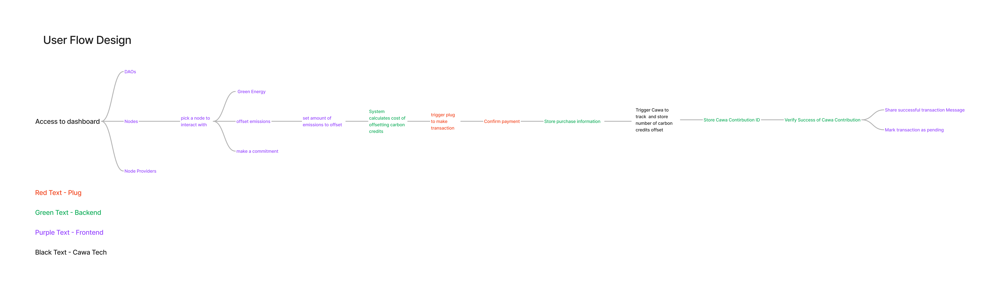

This is a visualization of the processes that take place when interacting with nodes, specifically, ofsetting a node's carbon footprint.

[Figma Link](https://www.figma.com/file/0zWyY7DTNV12zB1Z2QsGHl/Userflow?type=whiteboard&node-id=0%3A1&t=O8kaNPWQgmNQrJwk-1)

